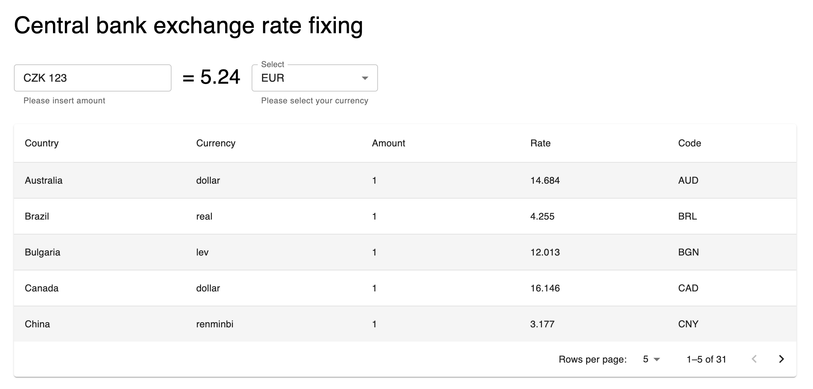

# Momence Interview

## Task

Create a simple React app (don’t use NextJS please), which:

1. When it starts, retrieve the latest currency exchange rates from the Czech National Bank.
   API URL: https://www.cnb.cz/en/financial-markets/foreign-exchange-market/central-bank-exchange-rate-fixing/central-bank-exchange-rate-fixing/daily.txt
   Documentation: https://www.cnb.cz/en/faq/Format-of-the-foreign-exchange-market-rates/

2. Parses the downloaded data and clearly displays it to the user in the UI.

3. Add a simple form, into which the customer can enter an amount in CZK and select a currency, and after clicking a button sees the amount entered in CZK converted into the selected currency.

4. Commit your code throughout your work and upload the resulting codebase into a Github repo.

5. Tech stack: React (+Hooks), TypeScript, Styled Components, React Query.

Overall: Keep the code simple and the UI nice and easy to use for the user.

### Screen of created app



## Implementation

In this repo I used something I have never work with -- **[Nx](https://nx.dev)** a fast and extensible build system to try it out.
It is insainly powerfull I must say. For this kind of small application it is little bit overkill I know :)

### How to run

```ts
yarn start     // will run server and client at once
yarn test      // will run all unit and e2e tests of all apps
yarn storybook // will open component library
yarn lint      // will run all linters for all projects

nx serve server   // will start server
nx serve client   // will start client
```

<br>

I have create 4 applications:

- **client** -- _main client app + storybook as a component library_
- **server** - _simple express backend for client app that is used as a proxy to CNB api_
- **client-e2e** - _some cypress e2e tests of client application_
- **server-e2e** - _basic server e2e tests which should test the API_

<br>

- **shared** - _library that shares some types and data-testid attribut values across the apps_

<br>

### Application Graph

(generated by **nx**)


